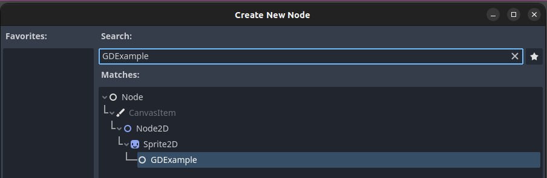

# GDExtension C++ Example

This is an example C++ GDExtension based on the official documentation:

https://docs.godotengine.org/en/stable/tutorials/scripting/gdextension/gdextension_cpp_example.html

# Build Instructions

Clone the repo. Update git submodules:
```
git submodule update --init
```

From the repo's main directory, run the following:
```
scons platform=linux
``` 

Replace `linux` in the command above with your target operating system (e.g. `macos` or `windows`). 

If you leave the platform blank, like below, `scons` will give helpful text showing valid values:

```
$ scons platform=
scons: Reading SConscript files ...
scons: *** Invalid value for option platform: .  Valid values are: ('linux', 'macos', 'windows', 'android', 'ios', 'web')
```

Important note for android: you will need to set an environment variable `ANDROID_NDK_ROOT` to the directory of your Android NDK. The NDK directory should contain the `build` and `toolchains` folders.
```
export ANDROID_NDK_ROOT=~/Android/Sdk/ndk/26.1.10909125/
```

Now that the environment variable is set, run the `scons` command:
```
scons platform=android
```

Godot will now detect the built extension. Try creating a new node and search for `GDExample`:



Project file structure for reference:
```
gdextension-cpp-example/
|
+--demo/                  # sample game to test the extension
|   |
|   +--main.tscn
|   |
|   +--bin/
|       |
|       +--gdexample.gdextension
|
+--godot-cpp/             # Godot C++ bindings
|
+--src/                   # source code of the extension we are building
|   |
|   +--register_types.cpp
|   +--register_types.h
|   +--gdexample.cpp
|   +--gdexample.h
```
